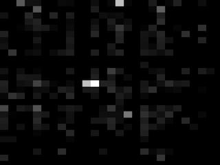

KeySig
---

Extract useful statistics from keyboard events, generate unique signatures and detect intruders.  
See also: [Keylogger](https://github.com/rikonor/keysig/tree/master/keylogger).

Goals
---

* Extract metrics from keystroke data.
* Generate a verifiable signature from the metrics.
* Create a mechanism to authenticate a user based on a previous signature.

Metrics
---

* Duration of key press [**_durationOfPress_**]
* Duration of key transition [**_timeToNext_**]
* Distribution of keys [**_keyDistribution_**]
* Length of line [Not implemented]
* Spelling mistakes [Not implemented]

Initial Results
---

Evolution of a _timeToNext_-based signature over the course of 3 hours. Frames were taken every 3 minutes. No filtering was done at this point.

The shade of gray represents the transition duration relative to the others.
Black squares indicate either a very fast transition time relative to the other transitions or one that hasn't been encountered yet.

Evolution of a _durationOfPress_-based signature showing average keypress times.

Simple _durationOfPress_ chart showing average values.

_timeToNext_-based signatures from two runs of typing the same text (random wikipedia article).

##### Run 1

##### Run 2

References
---

* https://github.com/MarinX/keylogger
* https://github.com/caseyscarborough/keylogger
* http://osxbook.com/book/bonus/chapter2/alterkeys/
* https://github.com/montanaflynn/stats
* http://www.cs.cmu.edu/~keystroke/
* http://www1.cs.columbia.edu/~hgs/teaching/security/hw/keystroke.pdf
* https://www.keytrac.net
